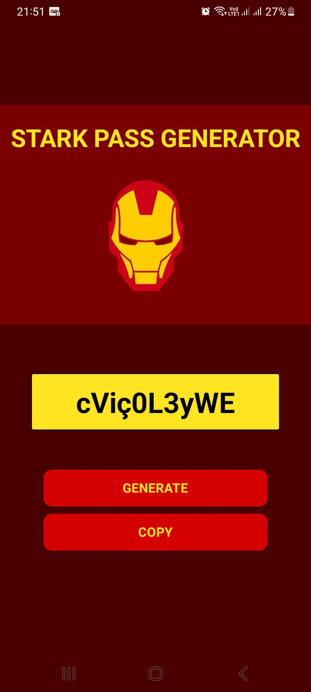
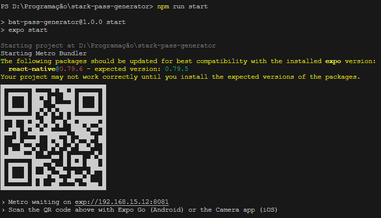

# App gerador de senhas 

>_💻 Status do projeto: Finalizado._

## Descrição do Projeto

O projeto se trata de uma aplicação mobile que gera senhas aleatórias que podem ser copiadas para a área de transferência.

## Tela



## Funcionamento

Nessa aplicação mobile existem 2 botões:

### GENERATE

Ao clicar esse botão gera uma senha aleatória de 10 caracteres e mostra na tela no lugar da palavra 'pass'.

### COPY

Ao clicar esse botão copia a senha apresentada na tela para a área de transferência do seu dispositivo, onde será possível colar a senha em janelas fora da aplicação.

## Como rodar

Ao baixar o projeto instale as dependências com:

```
npm install
```

Para rodar a aplicação use o comando:

```
npm run start
```

Será então gerado um QRCODE que será possível escanear pelo aplicativo _**EXPO GO**_.


